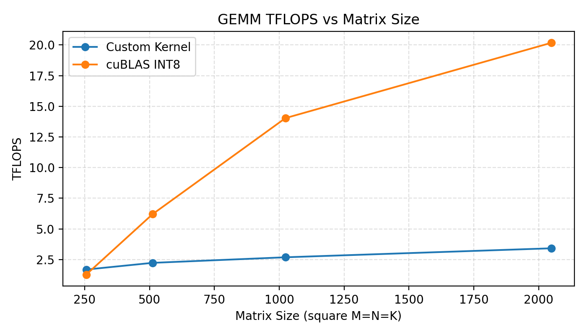
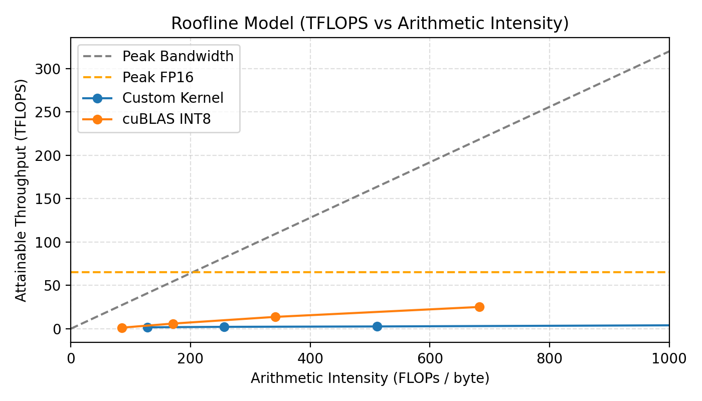
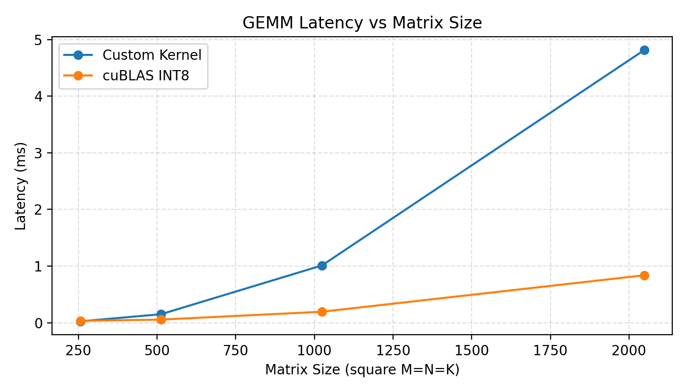

# CUDA INT8 WMMA GEMM Kernel

This repo is a portfolio project: although my professional background is distributed systems and cloud computing, it demonstrates that I can design, implement, validate, benchmark, and profile an optimized CUDA kernel end-to-end.

**What this project demonstrates**
1. Kernel design for Tensor Cores (WMMA INT8).
2. Correctness validation against a reference implementation.
3. Performance measurement (throughput, latency, roofline).
4. Profiling and iterative optimization planning.
5. Clean packaging as a PyTorch C++/CUDA extension.

**Quick links:** [Build & run](#build--run) | [Correctness tests](#correctness-tests) | [Benchmarks](#benchmarks-methodology) | [Results & interpretation](#results--interpretation) | [Roadmap](#roadmap)

**Technical highlights**
- WMMA INT8 kernel using 16x16x16 tiles with explicit row/column-major layouts.
- Shared-memory tiling with padding for alignment, vectorized int4 loads, and scalar edge handling.
- Per-column dequantization (`scaleA` scalar + `scaleB` vector) with FP16 output.
- PyTorch C++/CUDA extension with strict input validation and minimal Python API.

**Example (PyTorch)**
```
import torch
import gemm_api

M, K, N = 64, 64, 64
A = torch.randint(-128, 127, (M, K), device="cuda", dtype=torch.int8)
B_col = torch.randint(-128, 127, (N, K), device="cuda", dtype=torch.int8)
scaleA = 0.1
scaleB = torch.full((N,), 0.2, device="cuda", dtype=torch.float32)

C = gemm_api.wmma_int8_gemm(A, B_col, scaleA, scaleB)
print(C.shape, C.dtype)
```

**Environment expectations**
- NVIDIA GPU with Tensor Core INT8 support (SM75+ recommended).
- PyTorch build with CUDA enabled; CUDA toolkit/driver compatible with the PyTorch build.

**Benchmark plots:** [Throughput](benchmarks/results/throughput.png) | [Latency](benchmarks/results/latency.png) | [Roofline](benchmarks/results/roofline.png)

## Engineering lifecycle (what I executed)
1. **Problem framing**: INT8 GEMM with per-column dequantization, aiming for Tensor Core usage.
2. **Kernel design**: WMMA tiling, shared-memory staging, alignment strategy, edge handling.
3. **Correctness**: reference comparison and deterministic checks.
4. **Performance**: throughput/latency/roofline benchmarks against cuBLAS.
5. **Profiling**: Nsight Systems timeline to identify bottlenecks.
6. **Iteration plan**: concrete optimization roadmap (see below).

## Architecture overview
```
Python API (python/gemm_api.py)
    -> C++ binding (csrc/gemm_kernel.cpp)
        -> CUDA launcher (csrc/gemm_kernel_cuda.cu)
            -> WMMA kernel (kernels/GEMMKernel.cu)
```

1. `python/gemm_api.py` exposes `wmma_int8_gemm` to Python and loads the compiled extension.
2. `csrc/gemm_kernel.cpp` validates shapes/dtypes/layouts and forwards to the CUDA entrypoint.
3. `csrc/gemm_kernel_cuda.cu` launches `wmmaInt8GemmKernel` from `kernels/GEMMKernel.cu`.
4. `kernels/GEMMKernel.cu` loads tiles into shared memory, executes WMMA, and dequantizes to FP16.
5. `triton_deploy/wmma_gemm_repository/1/model.py` shows how to serve the same API via Triton.

## Kernel details (WMMA INT8)
- **Tiling and WMMA**: 16x16x16 tiles with one warp per block, mapping exactly to Tensor Core WMMA fragments.
- **Shared memory**: A and B tiles are staged in shared memory; padding keeps the stride aligned for WMMA loads.
- **Alignment and loads**: 16-byte aligned int4 vector loads when possible, with scalar fallbacks for edges.
- **Dequantization**: Accumulate in int32, then dequantize with `scaleA * scaleB[col]` into FP16 output.

## Inputs/outputs and layout assumptions
- **A**: int8 CUDA tensor `[M, K]` row-major, contiguous.
- **B**: int8 CUDA tensor `[N, K]` column-major (stored as a contiguous transpose).
- **scaleA**: Python float; **scaleB**: float32 CUDA tensor `[N]`.
- **Output**: FP16 CUDA tensor `[M, N]`.
- All tensors must be on the same CUDA device and contiguous; `scaleB` length must equal `N`.

## Design decisions and tradeoffs
- **Column-major B** matches WMMA col-major requirements and avoids per-tile transposes in the kernel.
- **Shared-memory staging** prioritizes predictable access patterns over larger register pressure.
- **int4 vector loads** improve bandwidth when aligned; scalar fallback handles boundaries safely.
- **Explicit dequantization** preserves accumulator precision in int32 and makes scaling explicit.

## Build & run
Requirements: PyTorch with CUDA + NVIDIA GPU with Tensor Core INT8 support (SM75+ recommended).

```
python setup.py build_ext --inplace
PYTHONPATH=./python python - <<'PY'
import torch
import gemm_api

M, K, N = 64, 64, 64
A = torch.randint(-128, 127, (M, K), device="cuda", dtype=torch.int8)
B_row = torch.randint(-128, 127, (K, N), device="cuda", dtype=torch.int8)
B_col = B_row.t().contiguous()
scaleA = 0.1
scaleB = torch.full((N,), 0.2, device="cuda", dtype=torch.float32)

C = gemm_api.wmma_int8_gemm(A, B_col, scaleA, scaleB)
print(C.shape, C.dtype)
PY
```

## Correctness tests
Tests compare against a PyTorch int8 GEMM reference (`torch._int_mm`/`torch.ops.aten._int_mm`) plus identical dequantization. They cover edge sizes, random stress, determinism, and invalid-input validation.

```
python tests/test_gemm_kernel.py
```

Run a single test group:
```
python -c "import torch; from tests.test_gemm_kernel import test_happy_paths; test_happy_paths(torch.device('cuda'))"
```

## Benchmarks methodology
Benchmarks run fixed square sizes (256, 512, 1024, 2048), warm up 10 iterations, then time 50 iterations. Baselines use PyTorch int8 GEMM (`torch._int_mm`/`torch.ops.aten._int_mm`, backed by cuBLAS/cuBLASLt) with the same inputs and scales for direct comparison.

```
python benchmarks/throughput.py
python benchmarks/latency.py
python benchmarks/roofline.py
```

Profiling timeline:
```
nvcc benchmarks/profiling_timeline.cu kernels/GEMMKernel.cu -I kernels -std=c++14 -arch=sm_75 -o benchmarks/profiling_timeline
nsys profile -o nsys_report --stats=true ./benchmarks/profiling_timeline
```

## Results & interpretation
**Throughput**
| Matrix Size | Custom Kernel (TFLOPS) | cuBLAS INT8 (TFLOPS) | Speedup vs cuBLAS INT8 (x) |
|-----------:|--------------------:|--------------------:|---------------------------:|
| 256 | 1.69 | 1.28 | 1.32x |
| 512 | 2.23 | 6.21 | 0.36x |
| 1024 | 2.69 | 14.04 | 0.19x |
| 2048 | 3.42 | 20.17 | 0.17x |



#### Throughput interpretation
The table and plot show a clear crossover: at 256 the custom kernel is faster (1.69 TFLOPS vs 1.28 TFLOPS, 1.32x), while from 512 onward it falls behind. The growth in custom TFLOPS (1.69 → 3.42) is modest compared to cuBLAS (1.28 → 20.17), so the relative gap widens as matrix size increases. This is consistent with a kernel that performs well at small sizes but lacks the deeper tiling, multi-warp scheduling, and pipelining that cuBLAS uses to scale on large matrices.

**Roofline**


#### Roofline interpretation
Read the roofline left-to-right as arithmetic intensity increases: performance should rise until it approaches the compute roof. The custom kernel points sit noticeably below the roof, which aligns with the throughput table showing lower TFLOPS than cuBLAS at larger sizes. The vertical gap to the roof indicates headroom from memory access patterns and execution efficiency (shared-memory staging, occupancy, pipeline depth). cuBLAS is closer to the roofline, reflecting more complete optimization for both memory bandwidth and compute utilization.

**Latency**
| Matrix Size | Custom Kernel (ms) | cuBLAS INT8 (ms) | Latency Ratio vs cuBLAS INT8 (x) |
|-----------:|-------------------:|----------------:|---------------------------------:|
| 256 | 0.024 | 0.033 | 0.74x |
| 512 | 0.150 | 0.055 | 2.73x |
| 1024 | 1.011 | 0.194 | 5.21x |
| 2048 | 4.812 | 0.837 | 5.75x |



#### Latency interpretation
The latency table mirrors the throughput crossover: the custom kernel is faster at 256 (0.024 ms vs 0.033 ms), but becomes significantly slower as sizes grow. The ratio climbs from 2.73x at 512 to 5.75x at 2048, which is the inverse of the throughput gap. This pattern indicates that fixed overheads are not the dominant issue; instead, the kernel’s steady-state efficiency at scale is the bottleneck.

#### Overall interpretation
At small sizes (256) the kernel is competitive, while for larger sizes it trails cuBLAS. This is expected for a custom kernel without the full set of optimizations present in production libraries. The current results serve as a baseline for targeted optimization and demonstrate the full engineering cycle rather than claiming to beat cuBLAS today.

## Reproducibility notes
To capture your environment for reproducible results:
```
python - <<'PY'
import torch
print("Torch:", torch.__version__)
print("CUDA:", torch.version.cuda)
print("GPU:", torch.cuda.get_device_name(0))
PY
```

## Roadmap
1. Increase occupancy with multi-warp blocks and improved warp-level scheduling.
2. Pipeline shared-memory loads (double buffering) to hide memory latency.
3. Explore split-K and larger tiles to improve arithmetic intensity for big matrices.
4. Tune epilogue to reduce write bandwidth and fuse scaling.
5. Add more benchmark shapes (non-square, tall/skinny, wide/short).

## Limitations and scope
- Supports only INT8 inputs with FP16 output; no FP16/FP32 variants.
- Expects **B** in column-major layout (`[N, K]` contiguous transpose).
- Targets a single GPU; no multi-GPU or distributed execution support.